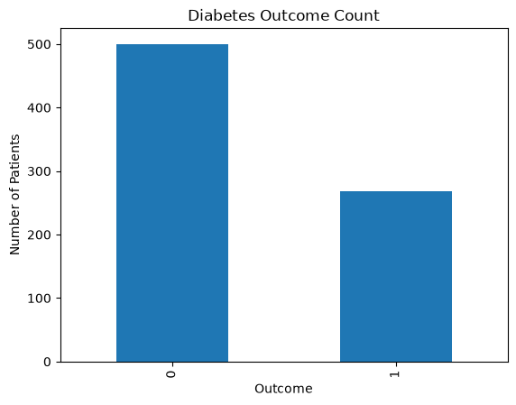
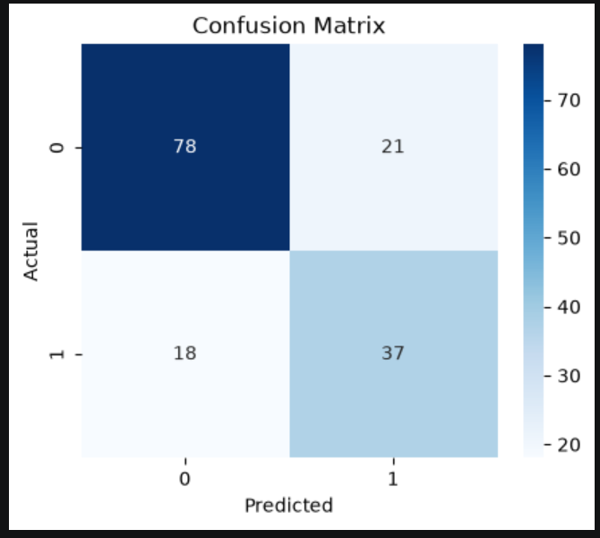

# 🩺 Diabetes Prediction Project

## 📌 Overview
This project predicts whether a patient is likely to have diabetes using Machine Learning.

The project uses the Pima Indians Diabetes Dataset and compares the performance of Logistic Regression and Random Forest classifiers.

---

## 🎯 Objective

- Predict diabetes from patient health data.
- Compare two Machine Learning algorithms.
- Evaluate model performance.

---

## 🛠️ Technologies Used

- Python
- Pandas
- NumPy
- Matplotlib
- Scikit-learn
- Jupyter Notebook

---

## 📂 Dataset

The dataset contains medical information such as:

- Pregnancies
- Glucose
- Blood Pressure
- Skin Thickness
- Insulin
- BMI
- Diabetes Pedigree Function
- Age
- Outcome

---

## 🤖 Machine Learning Models

- Logistic Regression
- Random Forest Classifier

---

## 📊 Results

| Model | Accuracy |
|--------|----------|
| Logistic Regression | 74.68% |
| Random Forest | 72.08% |

---

## 📈 Diabetes Outcome Count

---

## 📉 Confusion Matrix

---

## 👩‍💻 Author

**Milli Thapliyal**

B.Tech CSE Student
